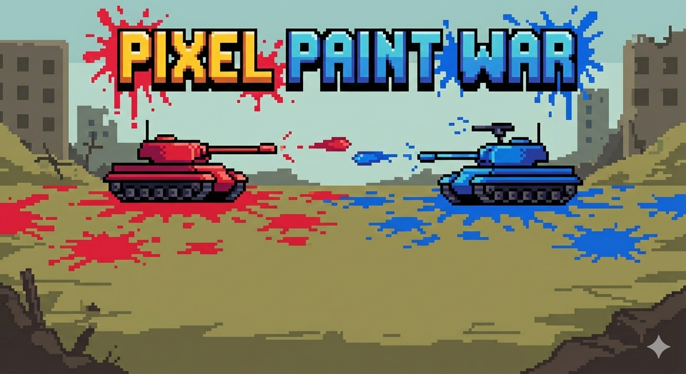
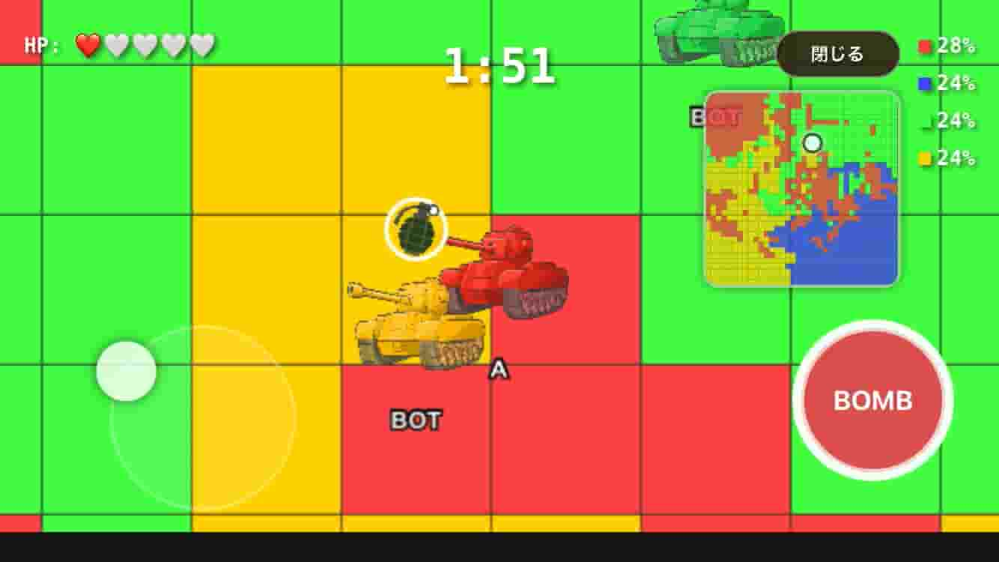

# Pixel Paint War



チーム対抗のリアルタイム陣取りペイントバトルゲームです。
最大4チームのプレイヤーがブラウザ上で同じフィールドに参加し、制限時間内に自チームの色でマスを塗りつぶして陣地を広げます。
終了時に最も多くのセルを塗ったチームが勝利です。



## 技術スタック

| 区分 | 技術 |
|---|---|
| フロントエンド | Vite + Preact + TypeScript |
| バックエンド | Node.js + TypeScript |
| 通信 | Socket.IO (WebSocket) |
| 描画 | Pixi.js (WebGL) |
| PWA | vite-plugin-pwa (インストール対応・フルスクリーン動作) |
| パッケージ管理 | pnpm workspaces (monorepo) |
| 開発環境 | Docker Dev Container |

## 推奨プレイ環境

スマートフォン・タブレットでプレイする場合は、ブラウザの「ホーム画面に追加」からWeb Appとしてインストールすることを推奨します。
フルスクリーン・横向き固定で快適にプレイできます。

## 開発環境のセットアップ

**必要なもの**: Docker、VS Code、VS Code拡張機能「Dev Containers」

1. リポジトリをクローンする
2. VS Codeでフォルダを開く
3. 左下の「><」アイコン →「Reopen in Container」を選択する
4. コンテナの起動を待つ（初回は数分かかります）

起動後、以下のコマンドで動作確認できます。

```bash
# 共有パッケージのビルド
pnpm --filter @repo/shared build

# クライアント起動（http://localhost:5173）
pnpm --filter client dev

# サーバ起動
pnpm --filter server dev
```

詳細は [ENV_04_環境構築手順書.txt](docs/02_ENV/ENV_04_環境構築手順書.txt) を参照してください。

## デプロイ

クライアント（静的ファイル）とサーバ（Node.js）を別々にデプロイします。
ビルド時に `VITE_PROD_SERVER_URL` にサーバのURLを設定する必要があります。

詳細は各手順書を参照してください。

| デプロイ先 | ドキュメント |
|---|---|
| Render | [ENV_09_Renderデプロイ手順.txt](docs/02_ENV/ENV_09_Renderデプロイ手順.txt) |
| 研究室サーバ（Nginx + Docker） | [ENV_10_研究室サーバデプロイ手順書.txt](docs/02_ENV/ENV_10_研究室サーバデプロイ手順書.txt) |
| 環境変数一覧 | [ENV_08_環境変数設定.txt](docs/02_ENV/ENV_08_環境変数設定.txt) |

## ドキュメント

### 開発ガイド

| ドキュメント | 内容 |
|---|---|
| [GUIDE_01_ドキュメント作成ガイド.txt](docs/01_GUIDE/GUIDE_01_ドキュメント作成ガイド.txt) | ドキュメントの書き方・フォーマット規則 |
| [GUIDE_02_ファイル命名規則.txt](docs/01_GUIDE/GUIDE_02_ファイル命名規則.txt) | ファイル・ディレクトリの命名規則 |
| [GUIDE_03_Git運用ルール.txt](docs/01_GUIDE/GUIDE_03_Git運用ルール.txt) | ブランチ・コミットの運用ルール |
| [GUIDE_04_コードコメント規則.txt](docs/01_GUIDE/GUIDE_04_コードコメント規則.txt) | コードコメントの書き方 |
| [GUIDE_05_プロトコル追加手順.txt](docs/01_GUIDE/GUIDE_05_プロトコル追加手順.txt) | Socket.IOイベントの追加手順 |

### 環境・構成

| ドキュメント | 内容 |
|---|---|
| [ENV_01_環境構築・技術スタック.txt](docs/02_ENV/ENV_01_環境構築・技術スタック.txt) | 技術スタックとプロジェクト構成 |
| [ENV_02_ディレクトリ構造.txt](docs/02_ENV/ENV_02_ディレクトリ構造.txt) | ソースコードのディレクトリ構造 |
| [ENV_04_環境構築手順書.txt](docs/02_ENV/ENV_04_環境構築手順書.txt) | 開発環境のセットアップ手順 |
| [ENV_05_Docker運用操作ガイド.txt](docs/02_ENV/ENV_05_Docker運用操作ガイド.txt) | Dockerの運用・操作コマンド |

### 仕様

| ドキュメント | 内容 |
|---|---|
| [SPEC_01_ゲーム概要_画面遷移.txt](docs/04_SPEC/SPEC_01_ゲーム概要_画面遷移.txt) | ゲーム概要・画面遷移フロー |
| [SPEC_02_ロビー仕様.txt](docs/04_SPEC/SPEC_02_ロビー仕様.txt) | ロビー画面の仕様 |
| [SPEC_03_ゲームプレイ仕様.txt](docs/04_SPEC/SPEC_03_ゲームプレイ仕様.txt) | ゲームプレイの詳細仕様 |
| [SPEC_04_HUD_UI仕様.txt](docs/04_SPEC/SPEC_04_HUD_UI仕様.txt) | HUD・UIの仕様 |
| [SPEC_05_リザルト仕様.txt](docs/04_SPEC/SPEC_05_リザルト仕様.txt) | リザルト画面の仕様 |

### 技術詳細

| ドキュメント | 内容 |
|---|---|
| [TECH_01_通信最適化.txt](docs/05_TECH/TECH_01_通信最適化.txt) | 通信量削減・最適化の実装方針 |
| [TECH_02_時刻同期_ラグ対策.txt](docs/05_TECH/TECH_02_時刻同期_ラグ対策.txt) | 時刻同期・ラグ補正の実装方針 |
| [TECH_03_描画最適化.txt](docs/05_TECH/TECH_03_描画最適化.txt) | 描画パフォーマンス最適化の実装方針 |

### テスト

| ドキュメント | 内容 |
|---|---|
| [TEST_01_負荷テスト仕様.txt](docs/06_TEST/TEST_01_負荷テスト仕様.txt) | 負荷テストの仕様・実行手順 |

## 作者

Rinto Hasegawa, Shimoji Ryuki

## ライセンス

[MIT](LICENSE)
